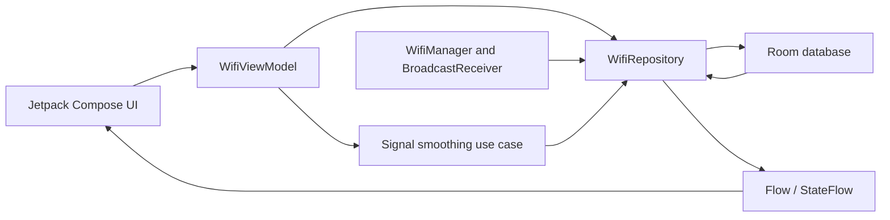

# Wifi Monitor

[](https://github.com/ktrubilo9/wifi-monitor-android/actions/workflows/android.yml)

Wifi Monitor is an Android application that scans nearby Wi-Fi networks and
tracks their signal strength over time. It stores scan results locally, applies
a moving average to RSSI measurements and presents current network information
and signal history in a Jetpack Compose interface.

The application was created as a university Mobile Systems project and later
extracted from the coursework repository into a standalone portfolio project.

## Features

- Periodic Wi-Fi scanning while the application is active.
- Nearby network list with SSID, BSSID, RSSI, frequency and link speed.
- Approximate distance estimation based on signal strength and frequency.
- Local scan history stored with Room.
- Five-sample moving average for reducing RSSI noise.
- Network detail screen with a chart of recent signal measurements.
- Clearing historical measurements for a selected network.
- Runtime permission flow with a link to system settings after permanent denial.

## Architecture



The UI observes reactive state exposed by the ViewModel. Wi-Fi scan results are
received through a `BroadcastReceiver`, persisted through the repository and
Room DAO, and transformed into smoothed measurements before being displayed.
Hilt provides the Android and data-layer dependencies.

## Technology

- Kotlin
- Jetpack Compose and Material 3
- ViewModel
- Kotlin coroutines, Flow and StateFlow
- Room
- Hilt
- Navigation Compose
- MPAndroidChart
- JUnit and coroutine testing utilities
- Gradle version catalog

## Requirements

- Android Studio with Android SDK 35
- JDK 17
- Device or emulator running Android 8.0 (API 26) or newer

A physical Android device is recommended because emulator Wi-Fi scan results
may not represent nearby networks.

## Running the Application

1. Clone the repository.
2. Open the project root in Android Studio.
3. Let Gradle synchronize the dependencies.
4. Run the `app` configuration on an Android device.
5. Grant the requested Wi-Fi and location permissions.

## Tests

Run the local unit tests with:

```bash
./gradlew testDebugUnitTest
```

The test suite covers the grouping, moving-average calculation and ordering of
the latest Wi-Fi measurements. GitHub Actions runs it for pushes and pull
requests targeting `main`.

## Platform Limitations

- Estimated distance is indicative only. Radio interference, obstacles and
  device hardware can significantly affect RSSI.
- Android restricts and throttles background Wi-Fi scanning.
- The application uses `WifiManager.startScan()`, which is deprecated on newer
  Android versions but remains useful for this educational experiment.
- Access to scan results requires location-related permissions on supported
  Android versions.
